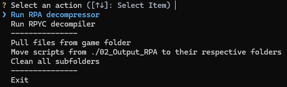
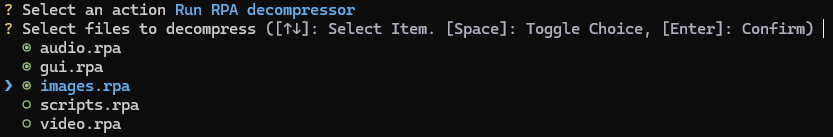
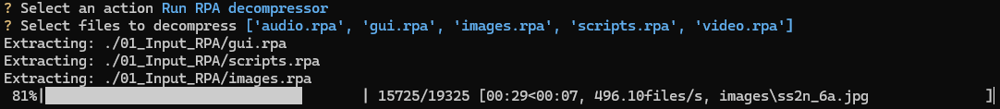
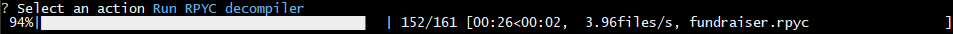
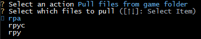
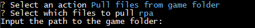
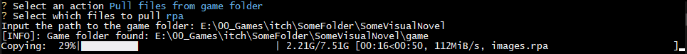
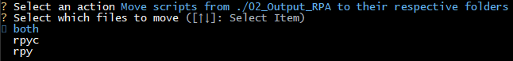
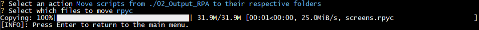
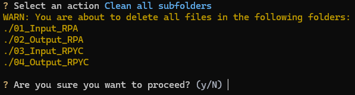

# DeRenPy [](https://github.com/J2bT/DeRenPy/blob/main/LICENSE)

**Язык**: [English](README.md) | [Русский](README_ru.md)

Обёртка над утилитами с открытым исходным кодом «UnRPA» и «UnRPYC», дополненная рядом функций для ускорения и упрощения декомпиляции игр на движке Ren'Py.

Пользователи Windows могут скачать готовый исполняемый файл на [странице релизов](https://github.com/J2bT/DeRenPy/releases/latest)! В этом случае раздел «Быстрый старт» следует пропустить. Вам нужно будет запускать скачанный файл вместо `main.py`.

***

## Быстрый старт
**ВНИМАНИЕ: Для выполнения инструкций у вас должны быть установлены Python 3.9+ и Git!**

Склонируйте репозиторий командой: `git clone --recursive https://github.com/J2bT/DeRenPy`.

Если вы уже клонировали репозиторий без подмодулей, инициализируйте их командой: `git submodule update --init`.

```bash
# 1. Перейдите в папку с репозиторием
cd DeRenPy

# ВАЖНО: В Windows замените `python3` на `py -3`!

# 2. (Необязательно) Создайте и активируйте виртуальное окружение
python3 -m venv venv
# Команда активации зависит от вашей ОС и оболочки. НЕ выполняйте их все.
# Если нужной команды нет в списке, её легко найти в интернете.
source venv/bin/activate	# Bash
venv\Scripts\Activate.ps1	# Windows PowerShell
venv\Scripts\activate.bat	# Windows cmd.exe

# 3. Установите зависимости
pip install -r requirements.txt

# 4. Только для Linux: сделайте `main.py` исполняемым
chmod a+x main.py
```

***

## Usage
У DeRenPy есть два режима работы: интерактивный и чисто консольный (CLI).

Если при установке вы создавали виртуальное окружение (venv), убедитесь, что оно активировано перед запуском проекта!

## Интерактивный режим
Просто запустите файл `main.py`. (Если это не сработает, выполните в терминале команду `python3 main.py` (Linux) или `py -3 main.py` (Windows).)

Если вы НЕ создавали виртуальное окружение при установке, скорее всего, сработает обычный двойной клик по файлу в проводнике.

Обратите внимание: интерактивный режим не поддерживает некоторые функции, доступные в консольном режиме. Выполнить можно всё, но потребуется больше действий. Например, вы не сможете распаковать файлы RPA, которые не находятся в папке `01_Input_RPA` — сначала придётся использовать функцию Pull (Импорт).



### Run RPA decompressor (Запустить распаковщик RPA)




### Run RPYC decompiler (Запустить декомпилятор RPYC)


### Pull files from game folder (Импортировать файлы из папки с игрой)






### Move scripts from ./02_Output_RPA to their respective folders (Переместить скрипты из ./02_Output_RPA в соответствующие им папки)




### Clean all subfolders (Очистить все подпапки)


## Чисто консольный режим (CLI)
В DeRenPy встроено руководство по использованию. Просто запустите программу с флагом `-h`. Приведённые ниже примеры демонстрируют далеко не все возможности.

```bash
# Распаковка RPA архива. Результат будет в папке `02_Output_RPA`.
main.py unrpa archive.rpa

# Декомпиляция скомпилированного скрипта RPYC. Результат будет в папке `04_Output_RPYC`.
main.py unrpyc script.rpyc

# Копирование всех файлов RPA из папки с игрой в `01_Input_RPA`. Можно также копировать файлы RPYC (в `03_Input_RPYC`) или RPY (в `04_Output_RPYC`).
main.py pull ~/Games/SomeVisualNovel rpa

# Перемещение всех RPYC файлов из `02_Output_RPA` в `03_Input_RPYC`. Можно также перемещать файлы RPY (в `04_Output_RPYC`) или оба типа (в соответствующие папки).
main.py move rpyc

# Удаление всех файлов из папок `01_Input_RPA`, `02_Output_RPA`, `03_Input_RPYC` и `04_Output_RPYC`.
main.py clean
```

### Подкоманда `unrpa`
Использование: `main.py unrpa [-h] rpa_file [rpa_file ...]`.

Если файл RPA находится в папке `01_Input_RPA`, путь можно не указывать. Расширение `.rpa` также можно опускать.

Совет: запуск `main.py unrpa -h` также покажет список всех RPA файлов в папке `01_Input_RPA`.

### Подкоманда `unrpyc`
Использование: `main.py unrpyc [-h] [rpyc_file ...]`.

Запуск без аргументов декомпилирует все файлы RPYC в папке `03_Input_RPYC`.

Вместо конкретного файла можно указать директорию — в этом случае будут декомпилированы все файлы RPYC в ней.

Если файл RPYC находится в папке `03_Input_RPYC`, путь можно не указывать. Расширение .rpyc также можно опускать.

### Подкоманда `pull`
Использование: `main.py pull [-h] game_path [{rpa,rpyc,rpy}]`.

Если тип файла не указан, по умолчанию копируются файлы RPA.

### Подкоманда `move`
Использование: `main.py move [-h] [{both,rpyc,rpy}]`.

Запуск без аргументов переместит файлы RPY и RPYC в их соответствующие папки (`both`).

### Подкоманда `clean`
Использование: `main.py clean [-h] [-y]`.

Флаг `-y` пропускает запрос подтверждения.


## License and credits
- Лицензия репозитория: GPL-3.0 (подробности в файле `LICENSE`).
- Благодарности [UnRPA](https://github.com/Lattyware/unrpa/): проект был бы невозможен без этой замечательной утилиты.
	- Лицензия UnRPA: GPL-3.0 (см. файл `LICENSE`).
- Благодарности [UnRPYC](https://github.com/CensoredUsername/unrpyc): проект был бы невозможен без этой замечательной утилиты.
	- Лицензия UnRPYC: MIT (см. файл `lib/unrpyc/LICENSE`).
- Благодарности [xaxa9551/De_RenPy](https://github.com/xaxa9551/De_RenPy): за идею и вдохновение.
- Благодарности [Waydroid Extras Script](https://github.com/casualsnek/waydroid_script): за идею, техническое вдохновение и прекрасный пример. Общая структура этого проекта во многом повторяет структуру <ins>Waydroid Extras Script</ins>. До того как я случайно наткнулся на этот репозиторий, я даже не подозревал о существовании библиотек `InquirerPy` и `tqdm` поэтому, увидев, как они работают в этом скрипте, я тоже захотел их использовать. Я многому научился благодаря этому репозиторию. Спасибо!
	- Лицензия Waydroid Extras Script: GPL-3.0 (см. файл `LICENSE`).
